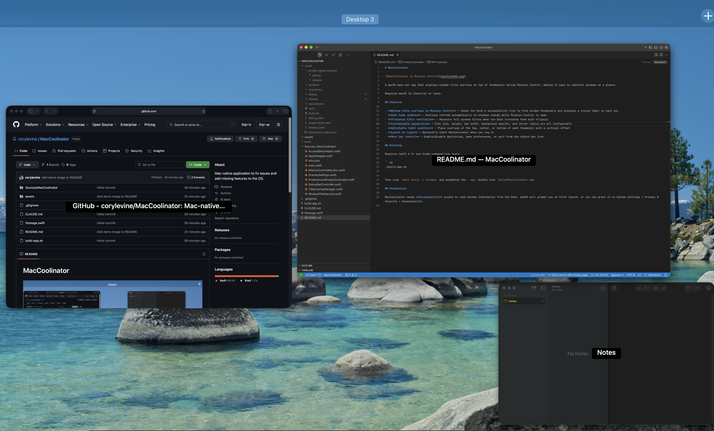

# MacCoolinator



A macOS menu bar app that displays window title overlays on top of thumbnails during Mission Control, making it easy to identify windows at a glance.

Requires macOS 13 (Ventura) or later.

## Features

- **Window title overlays in Mission Control** — Reads the Dock's accessibility tree to find window thumbnails and displays a styled label on each one
- **Real-time updates** — Overlays refresh automatically as windows change while Mission Control is open
- **Truncated title resolution** — Recovers full window titles when the Dock truncates them with ellipsis
- **Customizable appearance** — Font size, weight, max width, background opacity, and corner radius are all configurable
- **Adjustable label position** — Place overlays at the top, center, or bottom of each thumbnail with a vertical offset
- **Launch at login** — Optionally start MacCoolinator when you log in
- **Menu bar control** — Enable/disable monitoring, open preferences, or quit from the status bar icon

## Building

Requires Swift 5.9+ and Xcode command-line tools.

```sh
./build-app.sh
```

This runs `swift build -c release` and assembles the `.app` bundle into `build/MacCoolinator.app`.

## Permissions

MacCoolinator needs **Accessibility** access to read window information from the Dock. macOS will prompt you on first launch, or you can grant it in System Settings > Privacy & Security > Accessibility.
